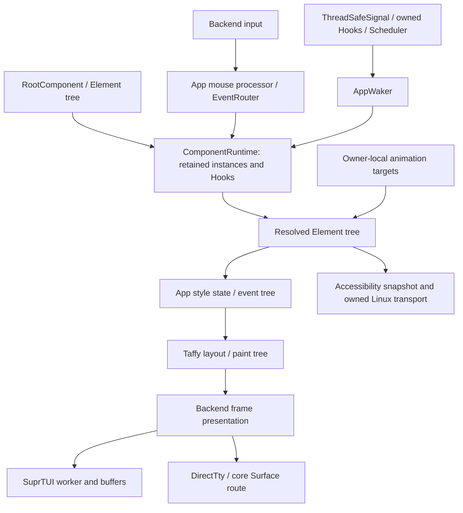

# Architecture and ownership map

This describes frozen production source. It is a source map, not a claim of runtime acceptance. The exhaustive file and symbol lists are in RUST_MAP.md and RUST_SYMBOLS.md; COVERAGE.md records review depth for every file.

## Main retained runtime

App coordinates retained rendering, dirty/wake state, routing, performance snapshots, animation samples, accessibility and cleanup. ComponentRuntime resolves component elements with retained hooks/instances; the resolved converter avoids automatic global component construction. Layout uses Taffy, with a second paint representation and backend-specific drawing. The supported SuprTUI path owns an output worker and patched Crossterm input. Direct/core rendering remains separately exported and has distinct ownership, style, input and capability behavior.

ScreenManager has its own ScreenRuntime/ComponentRuntime and target registries. Screen additionally maintains public VDOM/render-tree bookkeeping. That second conversion/registry path creates the ownership divergence in C01; ScreenRuntime's event integration differs from App in C03.

## Module responsibilities and parallel paths

| Area | Responsibility | Important boundary / findings |
| --- | --- | --- |
| src/app, src/component, src/hooks | App loop, retained component identity, hooks, scheduler, mouse dispatch | App versus Screen integration, C01–C04; hook playback/impulses C17–C19; callback/state ownership |
| src/reactive | Legacy Rc Signal/Memo/effect/runtime plus ThreadSafeSignal and wake machinery | Public Memo/RuntimeContext are distinct from owned Hooks; C07–C08 |
| src/event | Handler/router, focus, capture, keyboard/mouse, cache helpers | Router differs from exported cache helpers; C10–C11 |
| src/vdom, src/render, src/screen | VNode/Element conversion, standalone patches, render nodes, screens | Standalone diff is not App's normal reconciliation; C01/C09 |
| src/layout | Utility parsing, variants, StyleBuilder, Taffy layout, paint/hit geometry | Parser success can conceal missing conditional semantics; C05–C06/C12–C13/C16 |
| src/widgets, src/builder, src/theme | Retained controls, overlays, data/display widgets, construction, theme variables/colors | Chart worker/domain budgets, interaction, numeric sorting and callback replacement; W01–W08 |
| src/core | Surface/grapheme cells, span/diff writing, Terminal/Renderer, render operations, geometry | Several alternate painting/style authorities; T04/T10/T16/T17, N14/N22 |
| src/backend | Backend contract, direct backend, debug/cell frames, SuprTUI output/input workers | Input/present/flush contracts must stay consistent across implementations |
| src/platform, src/display | OS TTY input/session modes, escape parsing, event loops, capability/FPS policy | T01–T03/T07–T09/T11–T13 |
| src/terminal | Legacy emulator/parser/screen/reflow and Unix/Windows PTY sessions | Independent from public escape parser and optional Ghostty session |
| src/escape | Public byte-stream CSI/OSC/DCS parser | Separate parser with UTF-8/string-state defects T05–T06 |
| src/embedded | Optional owned Unix PTY worker interpreted through libghostty-vt | Feature + Unix gated; no claim about Windows support |
| src/graphics | Scene compile, CPU/GPU/hybrid raster, glyph/font resources, output, worker/widget | Optional wgpu-graphics feature; real CPU/GPU implementation, T14 process stderr risk |
| src/animation | Playback machine, modern/current-value API, targets, typed/untyped keyframes, spring/stagger/easing, alternate optimized/atomic/debug managers | Bound targets are real; optimized/cache/lock-free facades are separate APIs, N01/N03–N11/N16/N23–N24 |
| src/editor, src/syntax, src/markdown | Gap/text editor, grapheme painting, syntax parser/caches, Markdown AST→runs | Context lost between caches; full reparse; table metadata discarded, N12–N13/N18/N21 |
| src/ffi | C ABI handles, owned foreign callbacks/App route, legacy renderer/reactive/control wrappers | Some interfaces properly unsafe/owned, others safe raw dereferences/static facades, N02/N14–N15/N17/N20/N22 |
| src/accessibility | Semantics/style validation, snapshots/actions, Linux AccessKit translation and bounded transport | New owned transport inspected; retained upstream translation mostly structural coverage |
| src/error, src/lib.rs | Error/public surface and feature exports | Default feature is tokio; public export does not prove every auxiliary API is integrated |

## Workspace crates and provenance

| Crate | Role | Review limit |
| --- | --- | --- |
| reactive-tui-macros | Component/Props/FFI procedural macros | Expansion/error/panic-boundary structure mapped; no compilation performed |
| reactive-tui-crossterm | Vendored terminal events, commands and startup exchange | Owned Unix startup/input changes traced; retained upstream Windows/style paths primarily structural |
| reactive-tui-suprtui | Vendored cell buffers, drawing, Unicode and terminal output | Rendering/wide-cell/output paths traced; generated Unicode tables and large upstream helpers structurally mapped |
| libghostty-vt | Optional Rust Ghostty terminal wrapper | Provenance/API integration mapped; no complete independent upstream re-audit |
| libghostty-vt-sys | Native build/archive selection and generated ABI | Build plumbing and generated bindings mapped; no build/download/archive verification performed |

Cargo exports rlib and cdylib. `ffi` gates C exports; `wgpu-graphics` gates canvas modules and GPU/font dependencies; `embedded-terminal` enables the Unix Ghostty route; default is tokio. Accessibility's included Linux adapter deliberately uses its own async-io executor, independent of optional Tokio. Root build.rs has a GNU Windows cdylib linker setting. Examples, verification fixtures and benches are mapped as supporting code; user-directed review priority stayed on production bodies.

## Ownership divergences worth resolving

| State | Existing authorities | Concrete consequence |
| --- | --- | --- |
| Component lifetime | Retained ComponentRuntime, automatic render conversion, global legacy registry | Keyed cleanup removes replacements; duplicate Screen lifecycles, C01 |
| Reactive effects | Owned Hooks, legacy RuntimeContext/Effect, C boxed effect facade | Different update/cleanup contracts; C08/N20 |
| Text cell occupancy | SuprTUI buffer, core Surface, GraphemeSurface, editor painter, FFI loops | Wide/combined-text correctness diverges; N14/T17 |
| Terminal session | SuprTUI ownership guard, native UnixTty/WindowsTty, core Terminal, one-shot FFI Renderer | Independent restoration affects another owner; N22/T13 |
| Animation completion | Live inline branch, dead helper branch, timeline bool result, atomic alternate | Callbacks/direction/completion differ; N03–N06/N10 |
| Syntax line cache | Full-document parser output, editor LineCache, isolated-line parser | Lost context and duplicate full/visible work; N12–N13 |
| Diff statistics | Plain SpanDiffWriter::diff, separately implemented diff_with_stats | Instrumentation changes resize output; T16 |

The recommendation is to pick a supported authority for each contract and route adapters through it. Exported alternate APIs need explicit deprecation or supported limits if they are not being completed. Adding another helper/manager would increase the same integration problem.
